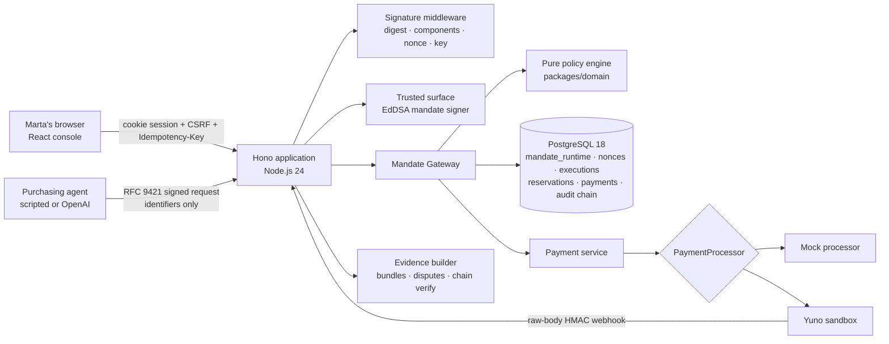
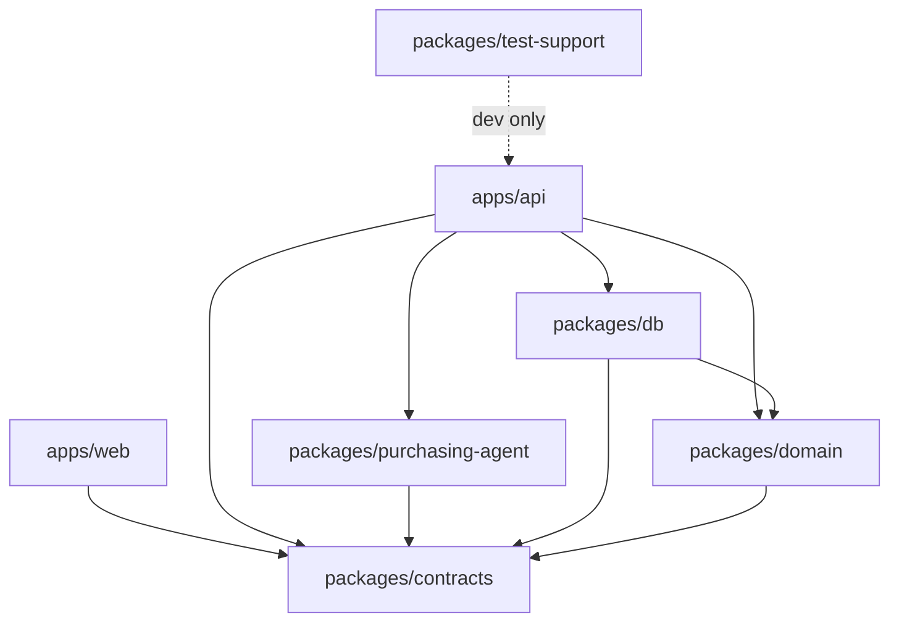

# Authera Architecture

## System overview



Authority lives in exactly two places: the **pure policy engine** (deterministic, clock injected, fails closed) and the **PostgreSQL reservation predicate** (one conditional `UPDATE` on `mandate_runtime` that revocation contends with). Nothing else — not the agent, not the browser, not the LLM — can produce `ALLOW`.

## Discovery across markets

`GET /api/flights` is one signed call, but the catalog behind it belongs to several merchants in several markets (seeded: VuelaYa/VE, AeroSur/AR, AndesGo Travel/CO; demo control can inject offers for any of them). Every offer is returned with `merchantId`, `merchantName`, and `market`. The purchasing agent prepares one UCP checkout per offer, compares all of them, and records `marketsSearched` and a one-sentence `selectionReason` in its run result and trace. The choice is the agent's; the authority is not — the gateway reloads the offer and merchant and enforces the mandate's `allowedMerchantIds` (`MERCHANT_NOT_ALLOWED`) regardless of what the agent argued.

### Live markets (`FlightMarketProvider`)

`apps/api/src/services/flight-market/` defines a provider port with two methods, `search` and `revalidate`, and a Duffel implementation (test mode). `CheckoutService.searchFlights` queries every configured provider with an 8 s budget, stores what came back as `offers` rows (`source = 'duffel'`, `provider_offer_id`, provider expiry) under the "Duffel Marketplace" merchant, expires live offers the provider no longer returns, and only then reads the catalog back from PostgreSQL. A provider failure is logged and skipped — discovery never depends on it. When a checkout session is created for a live offer, the provider is asked again for that exact offer: a new price is written to the row before the cart hash is computed, and a missing or expired offer raises `OFFER_NOT_AVAILABLE`. The purchasing agent drops any offer whose checkout fails and continues with the rest, so a stale live offer can never reach the gateway.

## Purchase sequence

```mermaid
sequenceDiagram
  participant Agent
  participant API as Authera API
  participant DB as PostgreSQL
  participant Pay as PaymentProcessor

  Agent->>API: POST /api/purchase-attempts (signed; executionId, mandateId, offerId, checkoutId)
  API->>API: Verify Content-Digest, components, created/expires, keyid → pinned key, tag
  API->>DB: Insert unique (agent key, nonce) — replay fails here
  API->>DB: Load mandate (verify JWS + hash), offer, checkout (recompute cart hash), merchant, agent, approval
  API->>API: evaluatePolicy(server-controlled input) → ALLOW / BLOCK / REQUIRE_HUMAN + checklist
  API->>DB: Persist checklist + POLICY_EVALUATED (hash-chained)
  alt ALLOW
    API->>DB: UPDATE mandate_runtime … WHERE status='ACTIVE' AND validity AND caps (+ consume approval)
    alt one row updated
      API->>Pay: purchase(executionId as idempotency key) — no transaction open
      Pay-->>API: SUCCEEDED / FAILED / PENDING
      API->>DB: settleExecution: consume or release exactly once, payment + execution + audit
      API-->>Agent: ALLOW, state, paymentId, evidenceId
    else zero rows
      API-->>Agent: BLOCK (MANDATE_REVOKED / USAGE_EXHAUSTED / RESERVATION_CONFLICT …)
    end
  else REQUIRE_HUMAN
    API->>DB: approval_requests (bound to the checkout hash)
    API-->>Agent: 202 REQUIRE_HUMAN + approvalRequestId
  else BLOCK
    API-->>Agent: 403 BLOCK + reason code
  end
```

## Human sequence

```mermaid
sequenceDiagram
  participant Marta
  participant API as Trusted surface
  participant DB as PostgreSQL
  Marta->>API: POST /api/mandates (intent, limits, validity, payment method)
  API->>API: Validate → canonical policy → SHA-256 hash → EdDSA JWS (cnf.jkt = agent key)
  API->>DB: mandates + mandate_versions (append-only) + mandate_runtime ACTIVE + audit, one transaction
  Marta->>API: POST /api/mandates/:id/revoke
  API->>DB: UPDATE mandate_runtime SET status='REVOKED' WHERE status='ACTIVE' (same row the gateway reserves on)
  Marta->>API: POST /api/approvals/:id/decision
  API->>DB: approval APPROVED with checkout hash; consumed once by the next matching attempt
  Marta->>API: POST /api/disputes
  API->>API: Build evidence bundle → deterministic resolver → AUTHORIZED / CUSTOMER_SUPPORTED / UNRESOLVED
```

## Components

| Component | Location | Responsibility |
|---|---|---|
| Config | `apps/api/src/config.ts` | Zod-validated env; mode-conditional secrets; fail fast, never echo values |
| Sessions, CSRF, idempotency | `apps/api/src/middleware/{session,csrf,idempotency}.ts` | Human lane guards |
| Signature middleware | `apps/api/src/middleware/agent-signature.ts` + `packages/domain/crypto/http-signatures.ts` | RFC 9421 verification, nonce replay, active-key checks, audit |
| Mandate signer | `apps/api/src/services/mandate-signer.ts` | Trusted-surface JWS issue/verify (jose) |
| Mandate service | `apps/api/src/services/mandate-service.ts` | Create/list/get/revoke/revise; plain-language summaries |
| Checkout service | `apps/api/src/services/checkout-service.ts` | Server-owned offers, canonical carts and hashes |
| Mandate Gateway | `apps/api/src/services/gateway.ts` (+ `gateway-store.ts`) | Orchestration from signed request to committed reservation |
| Policy engine | `packages/domain/src/policy/evaluate.ts` | Pure evaluator, ordered checklist, reason codes |
| Reservation / settlement | `packages/db/src/repositories/reservations.ts` | Atomic `UPDATE` predicate; idempotent consume/release |
| Payments | `apps/api/src/services/payments/*` | `PaymentProcessor` boundary, mock + Yuno adapters, webhook handling |
| Purchasing agent | `packages/purchasing-agent` | Scripted watcher + OpenAI agent with `search_flights` / `request_purchase` |
| Agent runner + demo | `apps/api/src/services/agent-runner.ts`, `routes/demo` | Runs the agent over signed HTTP; direct/forged/replayed/concurrent attempts |
| Approvals / disputes / evidence | `apps/api/src/services/{approval,dispute,evidence}-service.ts` | Checkout-scoped approvals, deterministic resolver, role-filtered bundles |
| Audit chain | `packages/db/src/repositories/audit.ts` | Serialized append with hash linking; verification |
| Console | `apps/web` | Perspective-separated route trees: client `/dashboard`, agent `/agent`, merchant `/verify`, auditor `/audit`, demo `/demo` |

## Package boundaries



- `packages/domain` imports no Hono, React, OpenAI, Yuno, `pg`, or Drizzle (lint-enforced).
- `apps/web` never imports `packages/db` or secrets; it talks only to `/api`, same origin.
- Provider-specific data never enters domain policy types.

## Data model (essentials)

`mandates` → `mandate_versions` (append-only signed policies) → `mandate_runtime` (the hot row: status, validity, caps, reserved/consumed counters). `executions` (one per signed attempt; id doubles as idempotency key) → `reservations` (unique per execution) → `payments` (unique per execution) ← `webhook_events` (unique per provider event). `nonces` unique per agent key. `approval_requests` bound to a checkout hash. `audit_events` with `previous_hash`/`hash` and a serialized `audit_chain_heads` row.

## Build and deployment

1. `vite build` compiles the console; `tsup` bundles the API (workspace packages inlined, third-party deps external).
2. The multi-stage `Dockerfile` produces one runtime image that serves the SPA from Hono.
3. `docker-compose.yml` runs PostgreSQL 18 + the app locally; `railway.json` deploys the same image with `/health/ready` as the gate.
4. On start the API migrates, loads key material (explicit JWKs or demo-derived), and seeds the demo scenario when `DEMO_MODE=true`.
