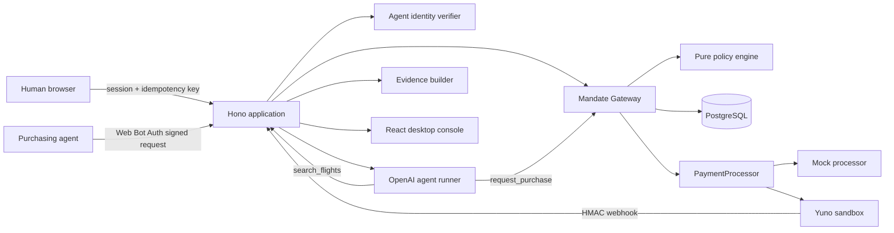
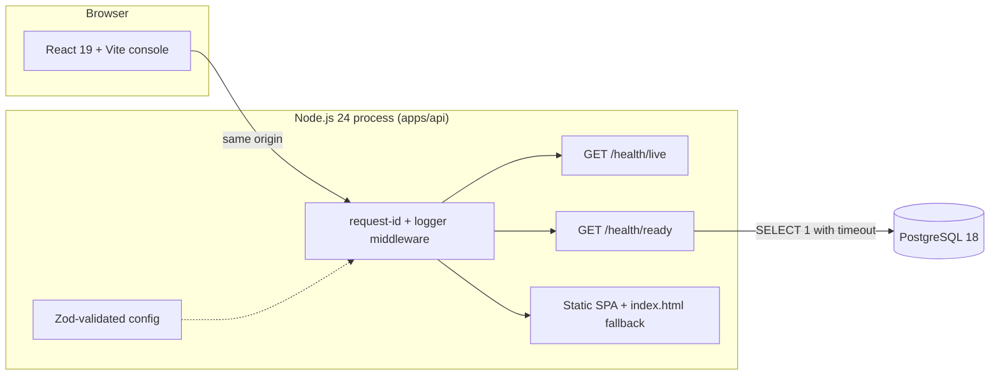
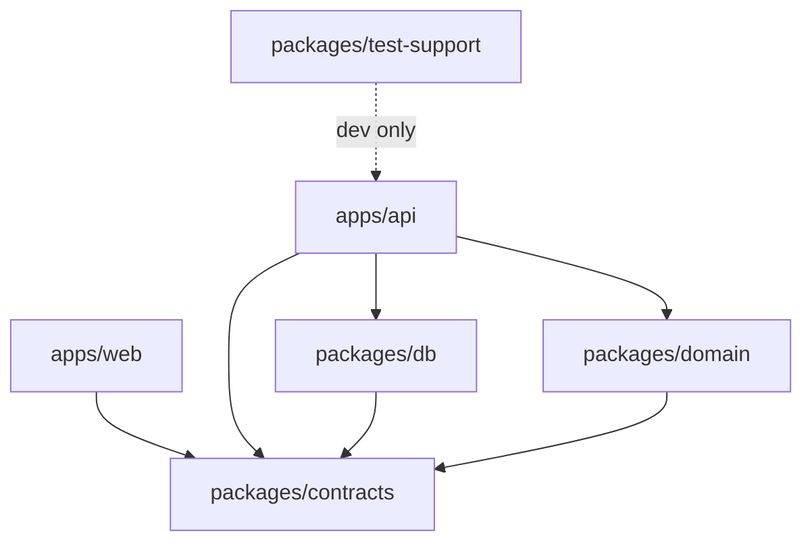
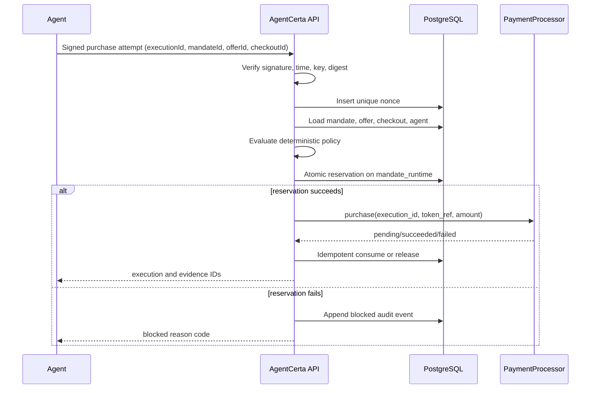

# AgentCerta Architecture

Status: **Phase 0** — deployable foundation. Diagrams show the target system from
`CLAUDE_IMPLEMENTATION_SPEC.md` §7 and mark what exists today.

## System overview (target)

Authority lives in exactly one place: the deterministic **Mandate Gateway** (pure policy
engine + atomic PostgreSQL state). The LLM discovers and requests; it never authorizes.

## What Phase 0 delivers

| Concern | Where | Notes |
|---|---|---|
| Environment contract | `apps/api/src/config.ts` | Mode-conditional secrets; fails fast without echoing values |
| HTTP envelope | `packages/contracts/src/common.ts`, `apps/api/src/http/envelope.ts` | `{ ok, data | error, requestId }` everywhere |
| Liveness / readiness | `apps/api/src/routes/health.ts` | Readiness = real DB round-trip; 503 with the failing check; never depends on OpenAI/Yuno |
| DB client | `packages/db/src/client.ts` | `pg` pool with connection timeout; credential-free error descriptions |
| Static serving | `apps/api/src/http/static.ts` | Backend namespaces (`/api`, `/health`, `/ucp`, `/.well-known`, `/webhooks`) never fall back to the SPA |
| Logging | `apps/api/src/logger.ts` | Pino JSON with redaction paths for auth headers, cookies, keys, tokens, secrets |
| Deployment | `Dockerfile`, `docker-compose.yml` | One app container + PostgreSQL; app waits for `service_healthy` |

## Package boundaries

- `packages/domain` is pure: no Hono, React, OpenAI, Yuno, `pg`, or Drizzle imports (ESLint `no-restricted-imports` enforces it).
- `apps/web` never imports `packages/db` or server secrets.
- Workspace packages export TypeScript source; `tsup` inlines them into `apps/api/dist/server.js`, while third-party runtime dependencies stay external and are installed in the image.

## Purchase sequence (target, Phase 5+)

## Build and runtime topology

1. `vite build` compiles `apps/web` to static assets.
2. `tsup` bundles `apps/api/src/server.ts` (+ workspace packages) to ESM.
3. The Docker runtime stage copies both plus the API's production `node_modules`.
4. Hono serves `/health` (and later `/api`, `/ucp`, `/.well-known`, `/webhooks`) and the SPA fallback from one process on one port.
5. Railway (or any Docker host) runs that image next to a PostgreSQL service; `/health/ready` gates deployment.
