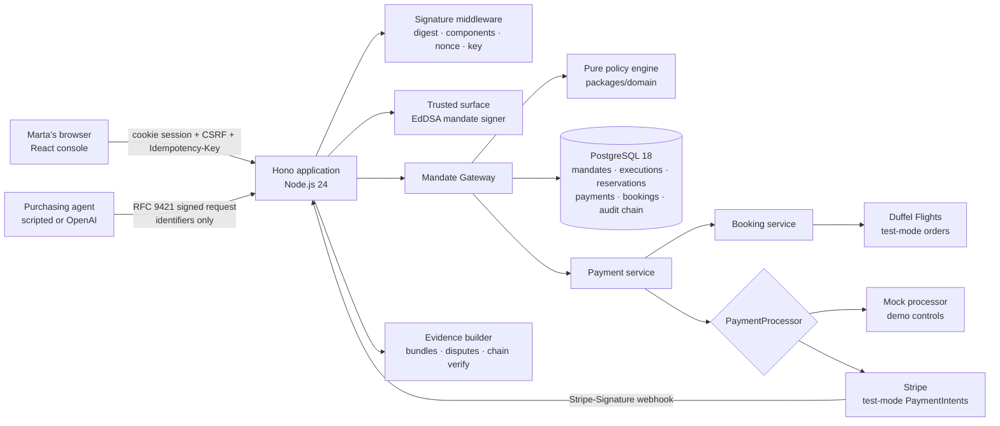
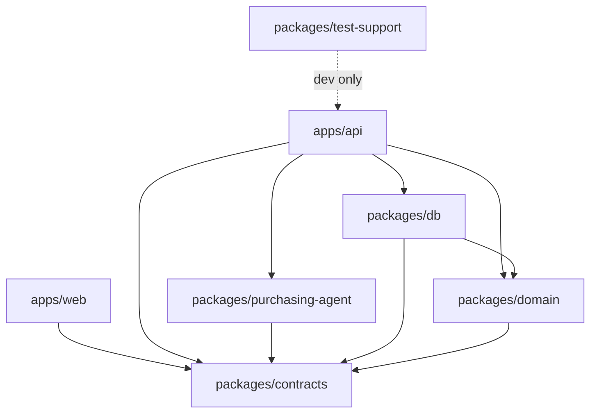

# Authera Architecture

## System overview



Authority lives in exactly two places: the **pure policy engine** (deterministic, clock injected, fails closed) and the **PostgreSQL reservation predicate** (one conditional `UPDATE` on `mandate_runtime` that revocation contends with). Nothing else — not the agent, not the browser, not the LLM — can produce `ALLOW`.

## Discovery across markets

`GET /api/flights` is one signed call over a catalog that is never seeded: offers come from live markets (Duffel today) and, in demo mode, from explicitly labelled judge injections. Merchants are the unit of scope — a mandate lists the merchant ids it allows. Every offer is returned with `merchantId`, `merchantName`, and `market`. The purchasing agent prepares one UCP checkout per offer, compares all of them, and records `marketsSearched` and a one-sentence `selectionReason` in its run result and trace. The choice is the agent's; the authority is not — the gateway reloads the offer and merchant and enforces the mandate's `allowedMerchantIds` (`MERCHANT_NOT_ALLOWED`) regardless of what the agent argued.

### Intents and categories

`MandatePolicyV1.intent` is a discriminated union. `flight` carries route, cabin, date window and passengers; `goods` carries the human's product description (`query`) and a maximum quantity. Offers carry a matching `kind`. The policy engine first checks `INTENT_KIND` (a flight offer can never satisfy a goods mandate or vice versa), then the kind-specific constraints: route/cabin/passengers/dates for flights; for goods, `INTENT_QUERY` — the offer must have been *discovered by the server under the mandate's exact query* (recorded in `offers.search_query` at discovery time, so the agent cannot relabel an offer) — and `INTENT_QUANTITY`. Money limits, usage counts, merchant scope, cart hash and approvals are shared. Adding a category is: one intent schema, one offer `kind`, one branch in step 7 of `evaluatePolicy`, one discovery provider.

### Goods market (`GoodsMarketProvider`)

`apps/api/src/services/goods-market/shopify-provider.ts` reads a public Shopify storefront (`/products.json`, `/products/<handle>.js`) — a real catalog with real prices and no credentials. Matching is a deterministic token match on title and product type done server-side; results are stored as `offers` rows (`kind = goods`, `source = shopify`, `search_query`), then read back. `GET /api/products?q=` is the signed browse-lane entry; the purchasing agent gets a `search_products` tool for goods mandates and the same identifiers-only `request_purchase`. The winner is re-priced with the storefront before the checkout binds its cart, exactly like Duffel offers.

### Live markets (`FlightMarketProvider`)

`apps/api/src/services/flight-market/` defines a provider port for `search` and `revalidate`, with a Duffel implementation in test mode. `CheckoutService.searchFlights` queries every configured provider with an 8 s budget, stores what came back as `offers` rows (`source = 'duffel'`, `provider_offer_id`, provider expiry) under the "Duffel Marketplace" merchant, expires live offers the provider no longer returns, and only then reads the catalog back from PostgreSQL. A provider failure is logged and skipped — discovery never depends on it. When a checkout session is created for a live offer, Duffel is asked again for that exact offer: a new price is written before the cart hash is computed, and a missing or expired offer raises `OFFER_NOT_AVAILABLE`.

Fulfillment is a separate server-side step. `BookingService` loads the traveler profile by the mandate's human id (the profile never enters an LLM tool), creates a `PENDING` booking, and asks Duffel for an instant order paid from its test balance. The request uses the passenger id attached to the reloaded offer and records the execution/Stripe ids as metadata. A validated test-mode order becomes `BOOKED`; a definite 4xx rejection becomes `FAILED`; a timeout, 5xx, or malformed 2xx stays `PENDING` because an airline order may already exist. The latter is never blindly retried.

## Purchase sequence

```mermaid
sequenceDiagram
  participant Agent
  participant API as Authera API
  participant DB as PostgreSQL
  participant Stripe as Stripe test mode
  participant Duffel as Duffel test mode

  Agent->>API: POST /api/purchase-attempts (signed; executionId, mandateId, offerId, checkoutId)
  API->>API: Verify Content-Digest, components, created/expires, keyid → pinned key, tag
  API->>DB: Insert unique (agent key, nonce) — replay fails here
  API->>DB: Load mandate (verify JWS + hash), offer, checkout (recompute cart hash), merchant, agent, approval
  API->>API: evaluatePolicy(server-controlled input) → ALLOW / BLOCK / REQUIRE_HUMAN + checklist
  API->>DB: Persist checklist + POLICY_EVALUATED (hash-chained)
  alt ALLOW
    API->>DB: UPDATE mandate_runtime … WHERE status='ACTIVE' AND validity AND caps (+ consume approval)
    alt one row updated
      API->>Stripe: confirm manual-capture PaymentIntent (executionId idempotency key)
      Stripe-->>API: AUTHORIZED / FAILED / PENDING
      alt Stripe authorized and live Duffel flight
        API->>DB: create PENDING booking + BOOKING_REQUESTED
        API->>Duffel: reload offer; POST /air/orders (instant, test balance)
        Duffel-->>API: confirmed order / definite rejection / ambiguous outcome
        alt booking confirmed
          API->>DB: BOOKED + provider order/reference
          API->>Stripe: capture PaymentIntent
          API->>DB: consume reservation; payment SUCCEEDED
        else definite booking rejection
          API->>Stripe: cancel authorization
          API->>DB: release reservation; BOOKING_FAILED
        else ambiguous
          API->>DB: keep booking/payment/reservation PENDING for reconciliation
        end
      else non-Duffel fulfillment or mock
        API->>Stripe: capture when authorization succeeds
        API->>DB: settleExecution: consume or release exactly once
      end
      API-->>Agent: ALLOW, state, paymentId, evidenceId
    else zero rows
      API-->>Agent: BLOCK (MANDATE_REVOKED / USAGE_EXHAUSTED / RESERVATION_CONFLICT …)
    end
  else REQUIRE_HUMAN
    API->>DB: approval_requests (bound to the checkout hash)
    API-->>Agent: 202 REQUIRE_HUMAN + approvalRequestId
  else BLOCK
    API-->>Agent: 403 BLOCK + reason code
  end
```

## Human sequence

```mermaid
sequenceDiagram
  participant Marta
  participant API as Trusted surface
  participant DB as PostgreSQL
  Marta->>API: POST /api/mandates (intent, limits, validity, payment method)
  API->>API: Validate → canonical policy → SHA-256 hash → EdDSA JWS (cnf.jkt = agent key)
  API->>DB: mandates + mandate_versions (append-only) + mandate_runtime ACTIVE + audit, one transaction
  Marta->>API: POST /api/mandates/:id/revoke
  API->>DB: UPDATE mandate_runtime SET status='REVOKED' WHERE status='ACTIVE' (same row the gateway reserves on)
  Marta->>API: POST /api/approvals/:id/decision
  API->>DB: approval APPROVED with checkout hash; consumed once by the next matching attempt
  Marta->>API: POST /api/disputes
  API->>API: Build evidence bundle → deterministic resolver → AUTHORIZED / CUSTOMER_SUPPORTED / UNRESOLVED
```

## Components

| Component | Location | Responsibility |
|---|---|---|
| Config | `apps/api/src/config.ts` | Zod-validated env; mode-conditional secrets; fail fast, never echo values |
| Sessions, CSRF, idempotency | `apps/api/src/middleware/{session,csrf,idempotency}.ts` | Human lane guards |
| Signature middleware | `apps/api/src/middleware/agent-signature.ts` + `packages/domain/crypto/http-signatures.ts` | RFC 9421 verification, nonce replay, active-key checks, audit |
| Mandate signer | `apps/api/src/services/mandate-signer.ts` | Trusted-surface JWS issue/verify (jose) |
| Mandate service | `apps/api/src/services/mandate-service.ts` | Create/list/get/revoke/revise; plain-language summaries |
| Checkout service | `apps/api/src/services/checkout-service.ts` | Server-owned offers, canonical carts and hashes |
| Mandate Gateway | `apps/api/src/services/gateway.ts` (+ `gateway-store.ts`) | Orchestration from signed request to committed reservation |
| Policy engine | `packages/domain/src/policy/evaluate.ts` | Pure evaluator, ordered checklist, reason codes |
| Reservation / settlement | `packages/db/src/repositories/reservations.ts` | Atomic `UPDATE` predicate; idempotent consume/release |
| Payments | `apps/api/src/services/payments/*` | `PaymentProcessor` boundary, mock + Stripe adapters, webhook handling |
| Payment processors | `apps/api/src/services/payments/{mock,stripe}-processor.ts` | Authorize, capture, and cancel behind one port; Stripe adapter accepts test keys only |
| Flight booking | `apps/api/src/services/booking-service.ts`, `flight-market/duffel-provider.ts` | Server-side traveler binding, Duffel sandbox order, definite/ambiguous failure classification |
| Purchase documents | `apps/api/src/services/purchase-documents.ts` | Escaped, printable payment receipt and booking confirmation; terminal-state gated and explicitly not a boarding pass/tax invoice |
| Purchasing agent | `packages/purchasing-agent` | Scripted watcher + OpenAI agent with `search_flights` / `request_purchase` |
| Agent runner + demo | `apps/api/src/services/agent-runner.ts`, `routes/demo` | Runs the agent over signed HTTP; direct/forged/replayed/concurrent attempts |
| Approvals / disputes / evidence | `apps/api/src/services/{approval,dispute,evidence}-service.ts` | Checkout-scoped approvals, deterministic resolver, role-filtered bundles |
| Audit chain | `packages/db/src/repositories/audit.ts` | Serialized append with hash linking; verification |
| Console | `apps/web` | Perspective-separated route trees: client `/dashboard`, agent `/agent`, merchant `/verify`, auditor `/audit`, demo `/demo` |

## Package boundaries



- `packages/domain` imports no Hono, React, OpenAI, Stripe, `pg`, or Drizzle (lint-enforced).
- `apps/web` never imports `packages/db` or secrets; it talks only to `/api`, same origin.
- Provider-specific data never enters domain policy types.

## Data model (essentials)

`mandates` → `mandate_versions` (append-only signed policies) → `mandate_runtime` (the hot row: status, validity, caps, reserved/consumed counters). `executions` (one per signed attempt; id doubles as Stripe idempotency key) → unique `reservations`, `payments`, and `bookings`; the booking retains Duffel order/reference/documents independently from payment. `traveler_profiles` belongs to users and is joined only inside the API. `webhook_events` is unique per provider event; `nonces` is unique per agent key; `approval_requests` bind to a checkout hash; `audit_events` link through a serialized chain head.

## Build and deployment

1. `vite build` compiles the console; `tsup` bundles the API (workspace packages inlined, third-party deps external).
2. The multi-stage `Dockerfile` produces one runtime image that serves the SPA from Hono.
3. `docker-compose.yml` runs PostgreSQL 18 + the app locally; `railway.json` deploys the same image with `/health/ready` as the gate.
4. On start the API migrates, loads key material (explicit JWKs or demo-derived), and seeds the demo scenario when `DEMO_MODE=true`.
