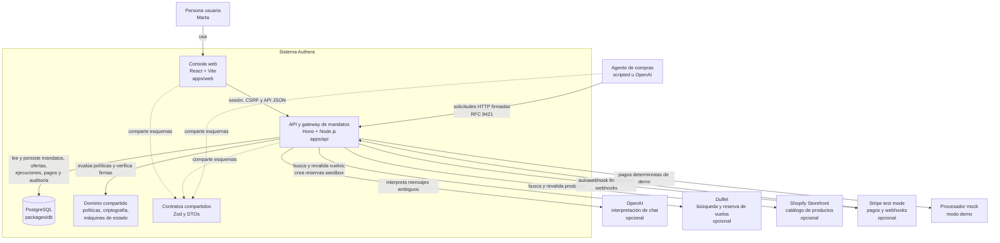
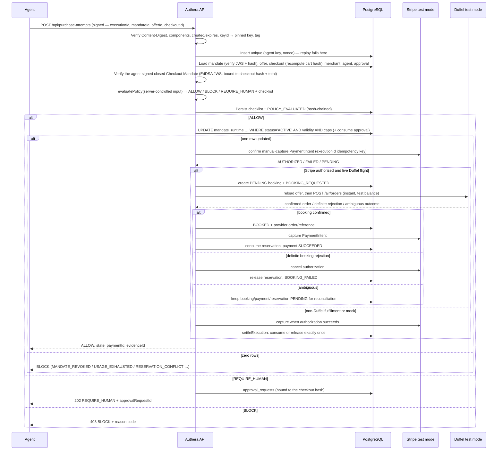
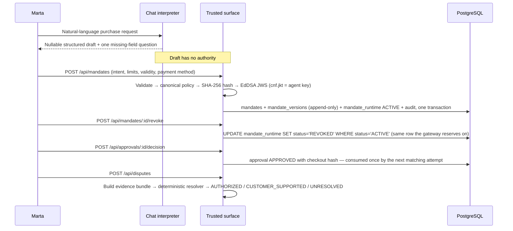
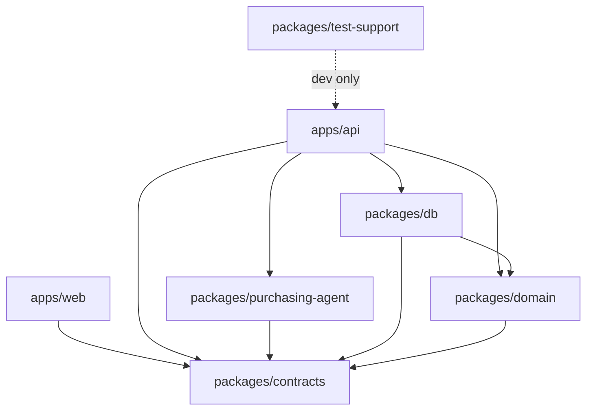

# Authera Architecture

## System overview


```

Authority lives in exactly two places: the **pure policy engine** (deterministic, clock injected, fails closed) and the **PostgreSQL reservation predicate** (one conditional `UPDATE` on `mandate_runtime` that revocation contends with). Nothing else — not the agent, not the browser, not the LLM — can produce `ALLOW`.

The client UX is conversational and flight-focused, but chat is not an authorization channel. `/api/chats` persists each ordered user/assistant turn and its nullable structured draft; closing the UI never ends a conversation. The chat interpreter (`MandateChatService`) uses a deterministic parser for grounded flight facts and an OpenAI structured-output interpreter for ambiguity and follow-ups. Deterministically extracted values are merged back after the model call, so the model cannot erase a recognized amount, route, or date. Natural expiration answers such as “tomorrow”, “today”, `08/30/26`, and “in the next 3 days” are resolved against the injected server clock only when validity is the missing field. The browser starts with a natural greeting, asks one question at a time, and renders a concise flight summary—never a mandate form or starter menu. Buttons appear only when the person can review, confirm, or change a consequential action. A separate trusted confirmation calls `POST /api/mandates`, where the server validates, hashes, signs, stores, and activates the exact policy, then links it to the chat. On an active plan, a requested change (maximum, purchases, validity, dates, passengers, outside-the-rules behaviour) is captured into the session draft, pinned by code (route, category and currency never change), diffed against the *signed* policy and shown as a pending revision; `POST /api/chats/:id/revision` confirms it through `MandateService.revise`, which re-signs the plan as version N+1 — every later attempt is judged by that version. A confirmed booking marks the conversation complete, but it remains reopenable to inspect the record or revoke remaining mandate authority. Chat deliberately does not project injected offers or operational controls: those live in the dedicated Demo surface.

## Discovery across markets

`GET /api/flights` is one signed call over a catalog that is never seeded: offers come from live markets (Duffel today) and, in demo mode, from explicitly labelled judge injections. Merchants are the unit of scope — a mandate lists the merchant ids it allows. Every offer is returned with `merchantId`, `merchantName`, and `market`. The purchasing agent prepares one UCP checkout per offer, compares all of them, and records `marketsSearched` and a one-sentence `selectionReason` in its run result and trace. The choice is the agent's; the authority is not — the gateway reloads the offer and merchant and enforces the mandate's `allowedMerchantIds` (`MERCHANT_NOT_ALLOWED`) regardless of what the agent argued.

### Intents and categories

`MandatePolicyV1.intent` is a discriminated union. `flight` carries route, cabin, date window and passengers; `goods` carries the human's product description (`query`) and a maximum quantity. Offers carry a matching `kind`. The policy engine first checks `INTENT_KIND` (a flight offer can never satisfy a goods mandate or vice versa), then the kind-specific constraints: route/cabin/passengers/dates for flights; for goods, `INTENT_QUERY` — the offer must have been *discovered by the server under the mandate's exact query* (recorded in `offers.search_query` at discovery time, so the agent cannot relabel an offer) — and `INTENT_QUANTITY`. Money limits, usage counts, merchant scope, cart hash and approvals are shared. Adding a category is: one intent schema, one offer `kind`, one branch in step 7 of `evaluatePolicy`, one discovery provider.

### Live markets (`FlightMarketProvider`)

`apps/api/src/services/flight-market/` defines a provider port for `search` and `revalidate`, with a Duffel implementation in test mode. `CheckoutService.searchFlights` queries every configured provider with an 8 s budget, stores what came back as `offers` rows (`source = 'duffel'`, `provider_offer_id`, provider expiry) under the "Duffel Marketplace" merchant, expires live offers the provider no longer returns, and only then reads the catalog back from PostgreSQL. A provider failure is logged and skipped — discovery never depends on it. When a checkout session is created for a live offer, Duffel is asked again for that exact offer: a new price is written before the cart hash is computed, and a missing or expired offer raises `OFFER_NOT_AVAILABLE`.

Fulfillment is a separate server-side step. `BookingService` loads the traveler profile by the mandate's human id (the profile never enters an LLM tool), creates a `PENDING` booking, and asks Duffel for an instant order paid from its test balance. The request uses the passenger id attached to the reloaded offer and records the execution/Stripe ids as metadata. A validated test-mode order becomes `BOOKED`; a definite 4xx rejection becomes `FAILED`; a timeout, 5xx, or malformed 2xx stays `PENDING` because an airline order may already exist. The latter is never blindly retried.

## Purchase sequence



## Human sequence



## Components

| Component | Location | Responsibility |
|---|---|---|
| Config | `apps/api/src/config.ts` | Zod-validated env; mode-conditional secrets; fail fast, never echo values |
| Sessions, CSRF, idempotency | `apps/api/src/middleware/{session,csrf,idempotency}.ts` | Human lane guards |
| Signature middleware | `apps/api/src/middleware/agent-signature.ts` + `packages/domain/crypto/http-signatures.ts` | RFC 9421 verification, nonce replay, active-key checks, audit |
| Mandate signer | `apps/api/src/services/mandate-signer.ts` | Trusted-surface JWS issue/verify (jose) |
| Mandate service | `apps/api/src/services/mandate-service.ts` | Create/list/get/revoke/revise; plain-language summaries |
| Mandate chat interpreter | `apps/api/src/services/mandate-chat.ts`, `routes/human/chat.ts` | Natural language → validated draft only; deterministic fast path + OpenAI ambiguity handling |
| Durable flight chats | `apps/api/src/services/chat-session-service.ts`, `packages/db/src/repositories/chats.ts` | Ordered resumable conversations linked to mandate and purchase lifecycle |
| Checkout service | `apps/api/src/services/checkout-service.ts` | Server-owned offers, canonical carts and hashes |
| Mandate Gateway | `apps/api/src/services/gateway.ts` (+ `gateway-store.ts`) | Orchestration from signed request to committed reservation |
| Policy engine | `packages/domain/src/policy/evaluate.ts` | Pure evaluator, ordered checklist, reason codes |
| Reservation / settlement | `packages/db/src/repositories/reservations.ts` | Atomic `UPDATE` predicate; idempotent consume/release |
| Payments | `apps/api/src/services/payments/*` | `PaymentProcessor` boundary, mock + Stripe adapters, webhook handling |
| Payment processors | `apps/api/src/services/payments/{mock,stripe}-processor.ts` | Authorize, capture, and cancel behind one port; Stripe adapter accepts test keys only |
| Flight booking | `apps/api/src/services/booking-service.ts`, `flight-market/duffel-provider.ts` | Server-side traveler binding, Duffel sandbox order, definite/ambiguous failure classification |
| Purchase documents | `apps/api/src/services/purchase-documents.ts` | Escaped, printable payment receipt and booking confirmation; terminal-state gated and explicitly not a boarding pass/tax invoice |
| Purchasing agent | `packages/purchasing-agent` | Scripted watcher + OpenAI agent with `search_flights` / `request_purchase` |
| Agent runner + demo | `apps/api/src/services/agent-runner.ts`, `routes/demo` | Runs the agent over signed HTTP; direct/forged/replayed/concurrent attempts |
| Approvals / disputes / evidence | `apps/api/src/services/{approval,dispute,evidence}-service.ts` | Checkout-scoped approvals, deterministic resolver, role-filtered bundles |
| Audit chain | `packages/db/src/repositories/audit.ts` | Serialized append with hash linking; verification |
| Console | `apps/web` | Chat-first client `/dashboard` with bottom dock; separate agent `/agent`, merchant `/verify`, auditor `/audit`, demo `/demo` perspectives |

## Package boundaries



- `packages/domain` imports no Hono, React, OpenAI, Stripe, `pg`, or Drizzle (lint-enforced).
- `apps/web` never imports `packages/db` or secrets; it talks only to `/api`, same origin.
- Provider-specific data never enters domain policy types.

## Data model (essentials)

`mandates` → `mandate_versions` (append-only signed policies) → `mandate_runtime` (the hot row: status, validity, caps, reserved/consumed counters). `executions` (one per signed attempt; id doubles as Stripe idempotency key) → unique `reservations`, `payments`, and `bookings`; the booking retains Duffel order/reference/documents independently from payment. `traveler_profiles` belongs to users and is joined only inside the API. `webhook_events` is unique per provider event; `nonces` is unique per agent key; `approval_requests` bind to a checkout hash; `audit_events` link through a serialized chain head.

## Build and deployment

1. `vite build` compiles the console; `tsup` bundles the API (workspace packages inlined, third-party deps external).
2. The multi-stage `Dockerfile` produces one runtime image that serves the SPA from Hono.
3. `docker-compose.yml` runs PostgreSQL 18 + the app locally; `railway.json` deploys the same image with `/health/ready` as the gate.
4. On start the API migrates, loads key material (explicit JWKs or demo-derived), and seeds the demo scenario when `DEMO_MODE=true`.
