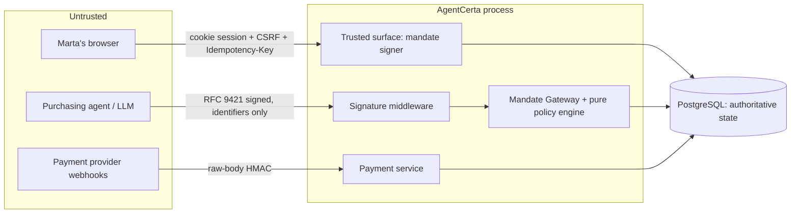

# AgentCerta Threat Model

Scope: the merchant-side mandate gateway that lets an AI purchasing agent buy on a human's behalf. This is a hackathon prototype with a credible production path; items marked **P2** are deliberately out of scope for the event build.

## Assets

| Asset | Why it matters |
|---|---|
| The human's money (tokenized payment method) | The whole point: it must move only under a valid mandate |
| Mandate authority (signed policy + live runtime state) | Forging, replaying, or stretching a mandate is the primary attack |
| Agent identity keys | Impersonating the agent inherits its mandates |
| Evidence trail (hash-chained audit events) | Disputes are settled from it; tampering must be detectable |
| Secrets: trusted-surface/merchant/agent private JWKs, session secret, Yuno keys, webhook secret | Compromise breaks signing or payment trust |

## Trust boundaries

Rules enforced at every boundary:

1. The LLM never returns the authorization decision; only `evaluatePolicy` (pure) plus the PostgreSQL reservation decide `ALLOW` / `BLOCK` / `REQUIRE_HUMAN`.
2. The agent submits identifiers only (`executionId`, `mandateId`, `offerId`, `checkoutId`); price, currency, merchant, offer, checkout, mandate and payment reference are loaded server-side.
3. The browser never supplies authoritative price, currency, merchant, or payment status.
4. Agent identity (signature) and human authority (mandate) are separate checks; a valid signature earns access to the agent lane, never permission to spend.

## STRIDE summary

| Threat | Vector | Control | Residual / P2 |
|---|---|---|---|
| **Spoofing** the agent | Request signed with another key; forged key advertising the real `keyid`; wrong `Signature-Agent` | RFC 9421 verification over `@method @authority @path content-digest signature-agent ucp-agent`; key resolved from the registered thumbprint; profile must match the agent's registered profile URI; revoked keys/agents rejected | Remote profile discovery (P1) needs HTTPS-only, no redirects, size/time limits, private-address rejection |
| **Spoofing** the human | Cross-site request from Marta's browser; stolen cookie | HttpOnly `SameSite=Lax` session cookie; custom `X-Requested-With` header + `Origin`/`Sec-Fetch-Site` checks; production refuses placeholder secrets | Passkey-bound approvals/revocations (P1/P2); session binding to IP/UA (P2) |
| **Tampering** with the cart | Change the cart after authorization | Canonical (RFC 8785) cart hash stored with the checkout and recomputed at evaluation; approvals bind the exact hash; mismatch → `CHECKOUT_HASH_MISMATCH` | — |
| **Tampering** with the mandate | Edit stored policy JSON; forge a mandate | Trusted-surface EdDSA JWS with canonical policy hash, `cnf.jkt` agent-key binding, `nbf/exp`; re-verified at evaluation and at evidence-bundle time; stored hash must equal signed hash | Cloud KMS/HSM for signing keys (P2) |
| **Tampering** with evidence | Rewrite or delete audit rows | Append-only repository API, per-event hash over canonical content + previous hash, serialized chain head, `verifyAuditChain` exposed to the console and disputes | Chain anchoring outside the database (P2) — the ledger is tamper-*evident*, not immutable |
| **Repudiation** | "I never authorized this" | Evidence bundle: human authorization (JWS), agent signature facts (digest, nonce), policy checklist, reservation, payment references, webhook receipts, chain verification, `bundleHash` | Passkey assertion linked to the action hash (P1) |
| **Information disclosure** | Leaking tokens/keys in logs or views | Pino redaction paths; role-filtered evidence (human: no digests/nonces/JWS; merchant: no personal identity); private keys only in env; token references, never tokens, in policies | Field-level encryption of token references (P2) |
| **Denial of service** | Flooding signed endpoints, huge bodies | 64 KB agent body limit, 256 KB webhook limit, short signature lifetime, nonce TTL | Rate limits on auth/discovery/purchase/demo (spec §17) not yet implemented (P1) |
| **Elevation of privilege** | Over-limit purchase; reuse of a one-use mandate; race two attempts; spend after revocation; replay a signed request | Pure evaluator with amount/date/route/cabin/passenger/currency/usage checks; single conditional `UPDATE` on `mandate_runtime` (revocation and reservation contend on the same row; count and amount caps enforced in SQL); unique `(agent_key, nonce)`; execution id as idempotency key; approvals lift amount caps only for the exact checkout hash and only once | — |
| **Payment integrity** | Double charge, duplicate webhook, provider outage | Execution id as provider idempotency key; provider call outside transactions; idempotent settlement (consume/release once); webhook dedupe by provider event id; terminal payments never move backward; outage → recoverable `PAYMENT_PENDING` | Yuno adapter unverified against a live sandbox |

## Demo-specific controls

- Demo routes exist only with `DEMO_MODE=true`, behind the console session + CSRF + `Idempotency-Key`, and call the same services as real traffic (they can inject offers and trigger attempts; they cannot insert a successful execution).
- Demo signing keys derive from `DEMO_RESET_SECRET`; production requires explicit private JWKs.
- The demo clock offset only applies when `DEMO_CLOCK_ENABLED=true` and never alters production time.

## Known gaps (honest list)

- No rate limiting yet.
- Passkeys (WebAuthn) not wired; human actions rely on the seeded session.
- `web-bot-auth` interoperability not exercised; RFC 9421 implemented in-house (documented deviation).
- Yuno REST/webhook field names follow public docs but are unverified without sandbox credentials.
- Single global audit stream (serialized) — fine at demo scale, sharded per merchant in production.
